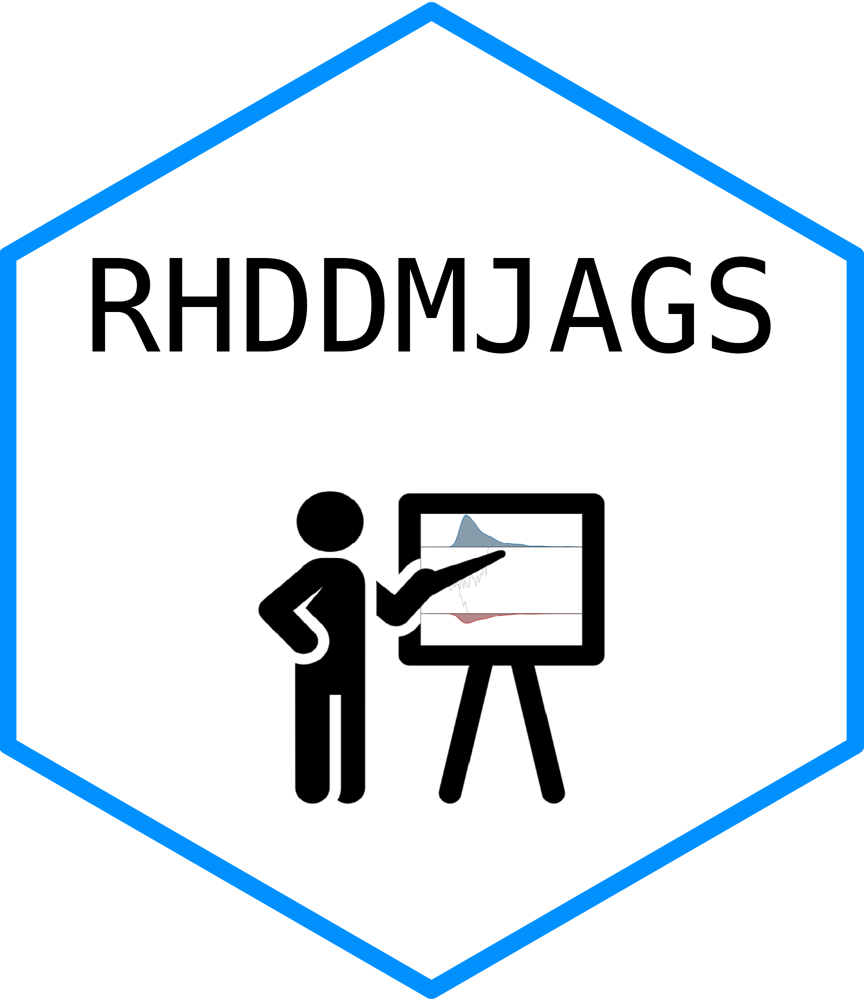

# Rhddmjags - Repository for example Hierarchical Drift Diffusion Model (HDDM) code using JAGS in R 

#### (Repository version 0.1.0)

## Prerequisites

- install R and RStudio on a laptop
- install the packages {R2jags}, {coda} from CRAN
- install JAGS
- install JAGS Wiener module

## Installation

You can install the packages used in these tutorials and get functions
that makes it easy to access the templates .Rmd files by running the
following code:

``` r
devtools::install_github('kiante-fernandez/Rhddmjags')
```

## Getting started

At the moment each script can be run individually to simulate from hierarchical drift-diffusion models (HDDMs) and then find and recover parameter estimates from those models. The most simple HDDM lives in nolapse_test.R. See other scripts: recovery_test.R, blocked_exp_conds.R, and regression_test.R. These scripts provide useful examples for using JAGS with Rjags, the JAGS Wiener module, mixture modeling in JAGS, and Bayesian diagnostics in R. 

The script nolapse_test_Rstan.R contains Rstan and Stan code to find and recover parameters from the exact same HDDM written in JAGS within nolapse_test.R. 

Then you can load examples with the following code:

``` r
Rhddmjags::example("nolapse")
Rhddmjags::example("regression")
Rhddmjags::example("joint")
```

## Resources

- **This code is based on Michael D. Nunez's Repo [`pyhddmjags`](https://github.com/mdnunez/pyhddmjags)**
- [MCMC Sampling Program: JAGS](http://mcmc-jags.sourceforge.net/)
- [MCMC Sampling Program: Stan](https://mc-stan.org/users/interfaces/)
- [Program: JAGS Wiener module](https://sourceforge.net/projects/jags-wiener/)

## Past Workshops

- 

### License

Rhddmjags is licensed under the GNU General Public License v3.0 and written by Kianté Fernandez from the Neruoeconomics group at the Ohio State Univeristy.


